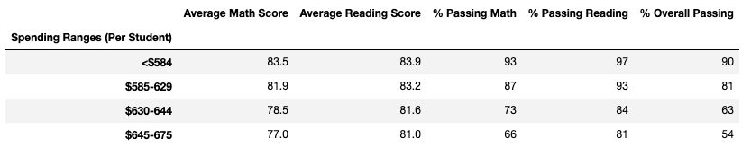

# School District Analysis
The State Board of Education found evidence of academic dishonesty in City School District. Specifically, reading and math grades of Thomas High School's ninth grade class appeared to have been altered. The State Board of Education has asked to remove the math and reading scores for Thomas High School's ninth grade class to uphold state-testing standards. 

## Purpose
This analysis describes how the removal of math and reading scores for Thomas High School's ninth grade class affected the overall performance of Thomas High School and City School District.    

## Results
For the purpose of this analysis, we will assume that the original results correspond to the data set that includes and the challenge results correspond to the data set that does not include reading and math grades for Thomas High School's ninth grade class. Below are the performance differences between the original and challenge results.

### 1. District Summary
Here are the changes for City School District performance caused by the score removal: 

1.1. Average math score decreased by 0.1 percentage points.
1.2. Average reading score remained unchanged.
1.3. Percentage of students that passed math decreased by 1 percentage point. 
1.4. Percentage of students that passed reading decreased by 1 percentage point. 
1.5. Percentage of students that passed both math and reading decreased by 1 percentage point. 

#### Original District Summary

#### Challenge District Summary

### 2. School Summary
Here are the changes for Thomas Highschool performance caused by the score removal: 

2.1. Average math score decreased by 0.07 percentage points. 
2.2. Average reading score increased by 0.05 percentage points. 
2.3. Percentage of students that passed math decreased by 26.36 percentage points. 
2.4. Percentage of students that passed reading decreased by 27.65 percentage points. 
2.5. Percentage of students that passed both math and reading decreased by 25.87 percentage points. 

#### Original School Summary

#### Challenge School Summary

### 3. Thomas High School's Performance 
Here's how Thomas High School was affected relative to the other schools in the district:

3.1. The original results show Thomas High School as the second highest performing school in the ditrict for overall passing percentage. 
         

3.2. The challenge results show Thomas High School as the eigth highest performing school in the district for overall passing percentage. This is a six point          drop in school rank. 
         
 

### 4. Math & Reading scores by grade
The challenge results were calculated with a data set that only removed the 9th grade math and reading scores for Thomas High School. Thus, the grades for all other classes and schools remained unchanged. 

#### Challenge Math Scores by Grade

    
#### Challenge Reading Scores by Grade

    
### 5. Scores by school spending
The $630-644 per student spending range was the only spending range affected. Here are the changes caused by the score removal: 

5.1. The percentage of students that passed math decreased by 6 percentage points. 
5.2. The percentage of students that passed reading decreased by 7 percentage points. 
5.3. The percentage of students that passed both math and reading decreased by 7 percentage points. 
   
#### Original Scores by School Spending

   
#### Challenge Scores by School Spending

   
### 6. Scores by school size
The medium (1,000-2,000) school size was the only school size affected. Here are the changes caused by the score removal: 

6.1. Percentage of students that passed math decreased by 6 percentage points. 
6.2. Percentage of students that passed reading decreased by 6 percentage points. 
6.3. Percentage of students that passed both math and reading decreased by 6 percentage points. 
   
#### Original Scores by School Size

   
#### Challenge Scores by School Size

   
### 7. Scores by school type
Charter school type was the only school type affected. Here are the changes caused by the score removal: 

7.1. Percentage of students passing math decreased by 4 percentage points. 
7.2. Percentage of students passing reading decreased by 4 percentage points. 
7.3. Percentage of students passing both math and reading decreased by 3 percentage points. 
   
#### Original Scores by School Type

    
 #### Challenge Scores by School Type

   
## Summary
There are four major changes from the removal of reading and math scores for the ninth grade at Thomas High School.  
1. Change #1
2. Change #2
3. Change #3
4. Change #4
