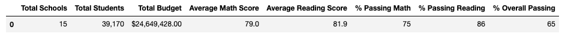
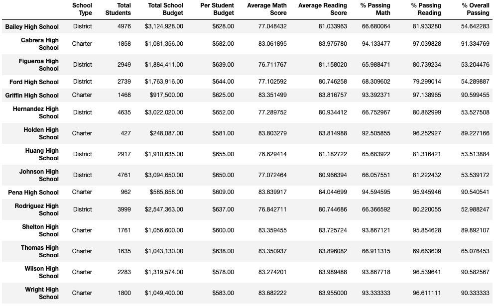

# School District Analysis

## Purpose
Explain the purpose of the analysis (compare it with the results from the module)

## Results

### District Summary
How is the district summary affected?
#### Original District Summary

#### Challenge District Summary

### School Summary
How is the school summary affected?
#### Original School Summary

#### Challenge School Summary

### Thomas High School's Performance 
How does replacing the ninth graders’ math and reading scores affect Thomas High School’s performance relative to the other schools?
#### Thomas High School's Position in Original

#### Thomas High School's Position in Challenge

### Scores
How does replacing the ninth-grade scores affect the following:
   - Math scores by grade
   #### Original Math Scores by Grade
   
   #### Challenge Math Scores by Grade
   
    
   - Reading scores by grade
   #### Original Reading Scores by Grade
   
   #### Challenge Reading Scores by Grade
   
    
   - Scores by school spending
   #### Original Scores by School Spending
   
   #### Challenge Scores by School Spending
   
   
   - Scores by school size
   #### Original Scores by School Size
   
   #### Challenge Scores by School Size
   
   
   - Scores by school type
   #### Original Scores by School Type
   
   #### Challenge Scores by School Type
   
   
## Summary
Summarize four major changes in the updated school district analysis after reading and math scores for the ninth grade at Thomas High School have been replaced with NaNs.
1. Change #1
2. Change #2
3. Change #3
4. Change #4
